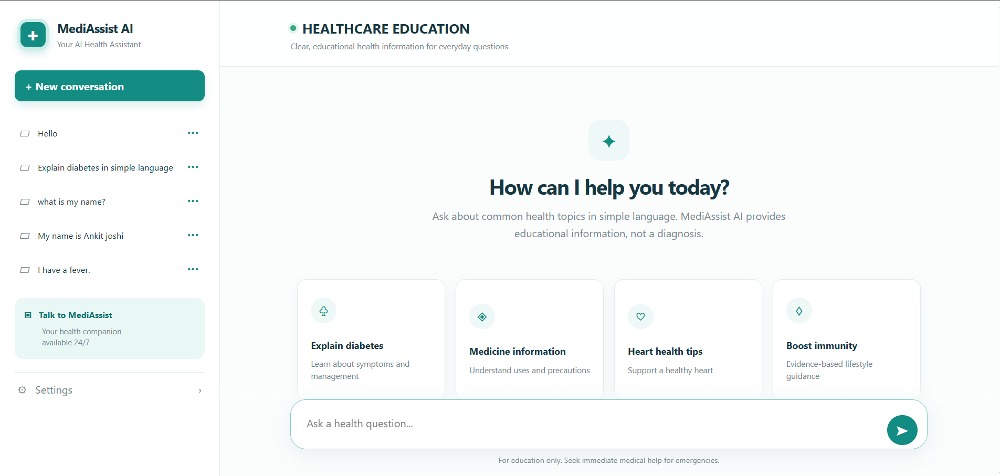
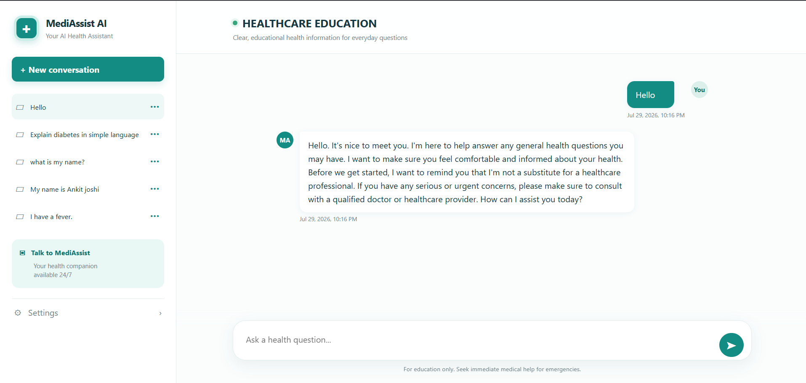
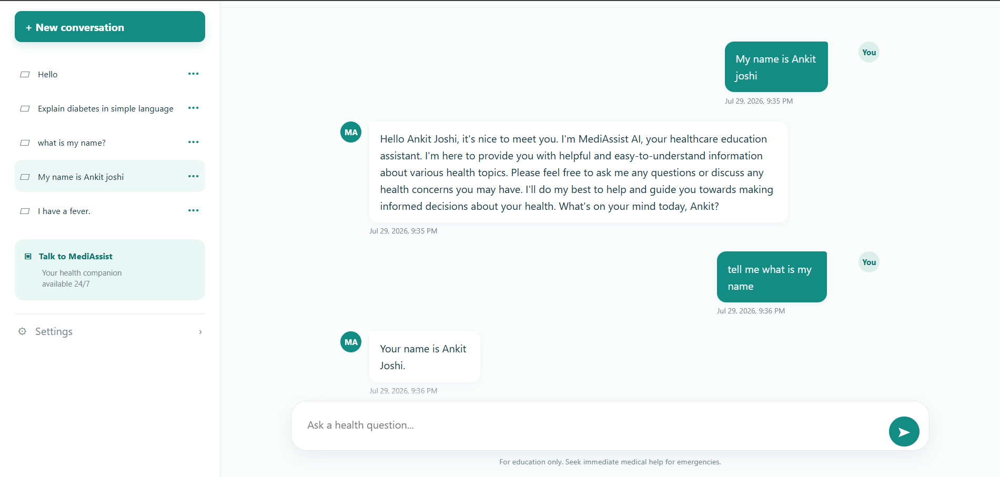
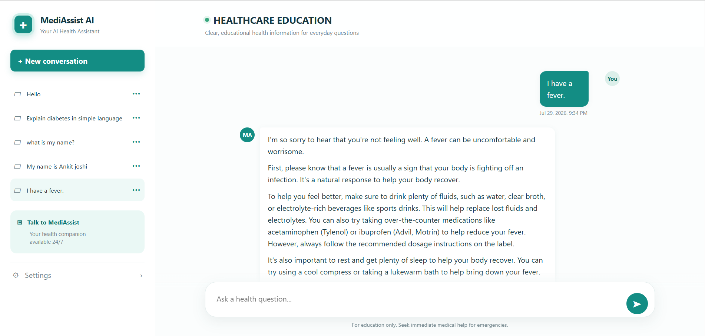
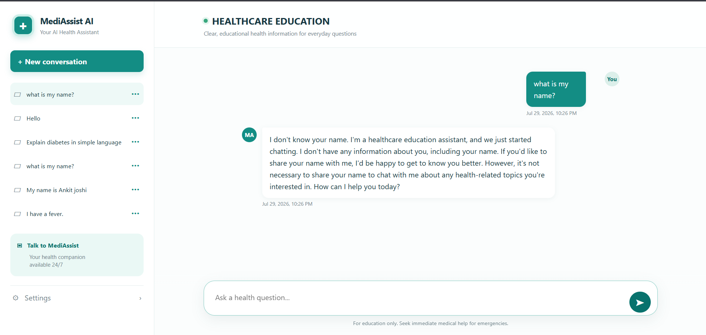

# MediAssist AI

MediAssist AI is a multi-conversation healthcare education chatbot. It explains common health topics in clear language while maintaining strict safety boundaries: it does not diagnose conditions, prescribe medicines, recommend dosage changes, or replace qualified healthcare professionals.

The project follows [`prd.md`](prd.md) for technical requirements and [`domain.md`](domain.md) for healthcare behavior and safety requirements.

## Features

- Create, list, open, rename, and delete conversations.
- Automatically name a conversation from its first prompt.
- Persist conversation history in SQLite.
- Generate educational responses through GroqCloud.
- Use `llama-3.3-70b-versatile` by default.
- Render assistant responses with Markdown.
- Provide starter health topics and healthcare disclaimers.

## Screenshots











## Technology

- Python 3.11+, FastAPI, and Uvicorn
- Pydantic Settings, SQLite, and HTTPX
- GroqCloud OpenAI-compatible Chat Completions API
- HTML, CSS, vanilla JavaScript, and Pytest

## Architecture

The application uses a layered architecture so each responsibility remains small and testable:

```text
Browser UI
    ↓
FastAPI routes and request validation
    ↓
Application services
    ↓
Repositories ─── SQLite database
    ↓
GroqCloud AI service
```

- `app/static/` contains the browser interface.
- `app/api/` contains HTTP routes, schemas, dependencies, and safe error handling.
- `app/services/` contains conversation and message business logic.
- `app/repositories/` isolates SQLite persistence.
- `app/ai/` contains the GroqCloud integration and healthcare safety policy.
- `app/config.py` loads environment-based configuration.

This separation keeps provider credentials out of the frontend and makes the database and AI provider easy to test independently.

## Why GroqCloud?

GroqCloud was selected for its fast inference, OpenAI-compatible chat-completions endpoint, production-ready `llama-3.3-70b-versatile` model, and straightforward bearer-token API. It provides responsive conversations while keeping the provider integration small and replaceable through the service layer.

## Requirements

- Python 3.11 or newer
- A GroqCloud account and API key
- Network access to `api.groq.com`

## Installation

```powershell
python -m venv .venv
.\.venv\Scripts\Activate.ps1
python -m pip install --upgrade pip
python -m pip install -e ".[dev]"
Copy-Item .env.example .env
```

On Windows, `py` may be used instead of `python`.

## Environment configuration

Edit `.env`:

```env
APP_NAME=MediAssist AI
APP_ENV=development
APP_HOST=127.0.0.1
APP_PORT=8000
GROQ_API_KEY=gsk_your_key_here
GROQ_MODEL=llama-3.3-70b-versatile
DATABASE_PATH=chatbot.db
```

Never commit `.env`, API keys, local databases, or logs. Never paste the complete API key into an issue, screenshot, terminal transcript, or chat.

## Run the application

```powershell
python -m uvicorn app.main:app --reload
```

Windows alternative:

```bat
py -m uvicorn app.main:app --reload
```

Open [http://127.0.0.1:8000](http://127.0.0.1:8000). Useful endpoints are `/health`, `/docs`, and `/`.

## Using the chatbot

1. Open the local URL.
2. Click **New conversation** or choose a starter topic.
3. Enter a health question and click send.
4. The first prompt becomes the conversation title.
5. Use the three-dot menu to rename or delete a conversation.

The assistant provides general education only. Seek qualified medical care for serious, urgent, persistent, or emergency concerns.

## API overview

```text
GET    /health
GET    /conversations
POST   /conversations
GET    /conversations/{conversation_id}
PATCH  /conversations/{conversation_id}
DELETE /conversations/{conversation_id}
POST   /conversations/{conversation_id}/messages
```

Create a conversation with `{ "title": "Diabetes education" }`.

Send a message with `{ "content": "What is diabetes?" }`.

The message response contains the saved user and assistant messages. Provider failures return a safe `502` response without exposing credentials.

## Project structure

```text
app/              Application package
app/ai/            Groq integration and healthcare safety policy
app/api/           FastAPI routes, schemas, dependencies, and errors
app/repositories/  SQLite persistence
app/services/      Business logic
app/static/        HTML, CSS, JavaScript, and favicon
tests/             Automated tests
docs/              Architecture, API, troubleshooting, screenshots
prd.md             Technical product requirements
domain.md          Domain and safety requirements
```

## Testing

```powershell
python -m pytest -q
```

Or run `.scripts\verify.ps1`.

Tests cover database isolation, API behavior, message persistence, provider handling, validation, error safety, and healthcare policy.

Manual smoke test: start the server, open the application, send `Explain diabetes in simple language.`, and confirm an assistant response appears in the conversation history.

## Healthcare safety

The system policy requires the assistant to provide educational information only, never diagnose conditions, never prescribe medicines or recommend dosage changes, encourage professional care, direct possible emergencies to immediate emergency medical assistance, and avoid emergency treatment instructions.

The assistant is not a substitute for professional medical advice and must not be used for diagnosis, treatment decisions, or emergencies.

## Troubleshooting

If the server does not start, reinstall dependencies with `python -m pip install -e ".[dev]"` and rerun Uvicorn.

If the browser does not load, open exactly `http://127.0.0.1:8000/`; the terminal should show `GET /`.

If AI responses fail, check that `.env` contains a `gsk_` key, the model is `llama-3.3-70b-versatile`, the key has quota, and antivirus/firewall/VPN/proxy permits Python to connect to `api.groq.com` over HTTPS. Restart after changing `.env`.

To reset local conversation history, stop the server, remove `chatbot.db`, and restart. Never delete or commit `.env`.

## Additional documentation

- [Architecture](docs/architecture.md)
- [API details](docs/api.md)
- [Troubleshooting](docs/troubleshooting.md)
- [Product requirements](prd.md)
- [Domain and safety requirements](domain.md)

## Future improvements

- User authentication and private conversation accounts
- Doctor appointment integration
- Voice input and spoken responses
- OCR for prescriptions and medical documents
- Medical report summarization
- Multi-language support
- Drug interaction checking with verified medical sources

## Author

Ankit Joshi  
Automation Engineer | Python | FastAPI | AI | RPA | UiPath
